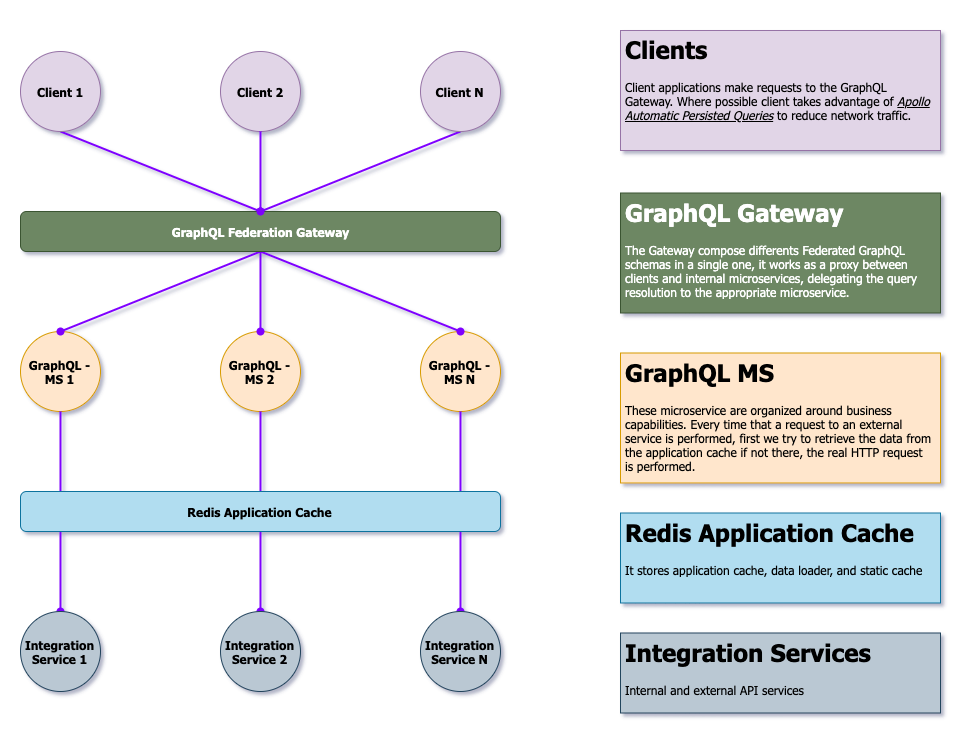

# Lazy Graphql

- [Development](#Development)
- [Architecture Overview](#ArchitectureOverview)

## Development

1. Use the version of node specified in `.nvmrc` example: `nvm use v12.13.1`.
2. Install dependencies and compile Typescript with `npm install`.
3. Start services in development mode with `npm run start:services`.

Have Fun! 🏄‍♂️

## Architecture Overview

